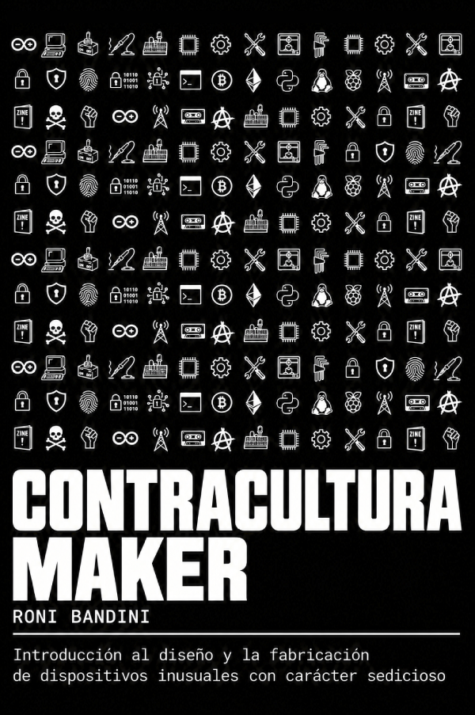

# 📕 Contracultura Maker / Maker (Counter)Culture

Contracultura Maker is a book about technology, counterculture, electronics, artificial intelligence, programming, privacy, art and activism.
It explores what happens when we stop being passive consumers of technology and start building, modifying and questioning the devices that surround us.

---

## 📚 Read the Book

The book is available in **Spanish** and **English**.

### 🇪🇸 Español

**Contracultura Maker — Tercera Edición, 2026**

[📖 Leer / descargar el libro PDF en español](ContraculturaMakerV3.pdf)

### 🇬🇧 English

**Maker (Counter)Culture — Third Edition, 2026**

[📖 Read / download the English PDF](MakerCounterCulture_English.pdf)

---

## 🏴 What is Contracultura Maker?

Contracultura Maker proposes taking maker culture into a critical and experimental direction.

Maker culture is usually associated with building, repairing, modifying and reusing technology. Contracultura Maker adds another dimension: using technology to question technology itself.

The book explores the relationship between:

- 🔧 Making, repairing, modifying and reusing technology
- 🤖 Machines, automata, robots and cyborgs
- 🎨 Electronic art and experimental devices
- 🧠 Artificial Intelligence and Machine Learning
- ⚡ Electronics and embedded systems
- 💻 Linux and programming
- 📡 UART, LoRa and device communication
- 🔐 Privacy, cryptography, PGP, GPG and steganography
- ₿ Bitcoin
- 🧩 Useless, absurd, speculative and experimental devices
- 🏴‍☠️ Activism, détournement and technological intervention

---

## 🧠 Learning by Making

Contracultura Maker embraces **Active Learning**: learning through practice rather than waiting until all the theory is understood before beginning.

Building something involves experimentation, debugging, failure, documentation and reflection.

The learning process can be confusing and uncomfortable. There is a liminal space between not knowing and understanding where frustration, uncertainty and partial knowledge are unavoidable.

The goal is not to eliminate this discomfort, but to learn how to inhabit it until the problem gradually becomes clearer.

Theory remains important, but it can emerge from the problems encountered during practice.

---

## ⚙️ A Different Relationship with Technology

Contracultura Maker proposes a less passive relationship with technology.

Instead of assuming that devices, platforms, interfaces and algorithms are closed and immutable systems, it proposes opening them, studying them, modifying them, reusing them and building alternatives.

Some devices can be deliberately unnecessary, excessive, absurd or strange.

Their value can lie precisely in what they allow us to think, question, learn or provoke.

> Building machines that perhaps should not exist can open new conversations and challenge the sacredness and absurdity of what has been established.

---

## 🤖 Technology, Machines and AI

The book moves between historical, philosophical and practical perspectives.

It examines machines, automata, robots and cyborgs; maker culture and counterculture; artificial intelligence and machine learning; electronics, Arduino, ESP32 and embedded systems; Linux and programming; communications technologies; privacy and cryptography.

It also explores the relationship between technology and autonomy: who designs the systems we use, what assumptions they contain, and what happens when we start modifying them ourselves.

---

## 📖 Contents

### 1. Introduction

Technology, domination, devices, consumption and creation.

### 2. 🤖 Machines, Automata, Robots and Cyborgs

- Machines
- Useless machines
- Dual relationship
- Automata
- Robots
- Cardinality
- Cyborgs

### 3. 🔧 Maker Culture

- Principles
- Motivations
- Key aspects
- Maker versus inventor
- The term maker

### 4. 🏴 Contracultura Maker

- Construction
- Détournement
- Navigating uncertainty
- Activism
- Meetups
- Instrumental reason
- Electronic art
- Maker templates
- Asking for help

### 5. 🧠 Artificial Intelligence

- Intelligence
- Artificial Intelligence
- Is AI intelligence?
- Weak and strong AI
- Machine Learning
- Data in Machine Learning
- Overfitting
- Generative AI
- LLMs
- Transformers
- Pre-training
- Reinforcement Learning
- Context and vector search
- When AI began
- AI risks

### 6. ⚡ Electronics

- Conductors and insulators
- Measurements
- Watts
- Series and parallel
- Direct and alternating current
- Switches
- Resistors
- Diodes and LEDs
- Potentiometers
- Capacitors
- Relays
- Transistors
- Amp-hours

### 7. 🔌 Arduino

- Parts of an Arduino program
- Variables and constants
- Pins
- PWM
- Comments
- Serial Monitor
- Conditionals
- Loops
- `for`
- Functions
- ESP32

### 8. 🖥️ UART

- Serial and parallel communication
- AT commands
- UART hacking

### 9. 📡 LoRa

- Chirp
- Meshtastic

### 10. 0️⃣ Binary

- Binary to decimal
- Decimal to binary

### 11. 🐧 Linux

- Terminal access
- Commands and navigation

### 12. 🐍 Programming

- Hello World
- Comments
- Variables
- Addition and multiplication
- Substrings
- Keyboard input
- Mathematical functions
- Graphics
- Conditionals
- Arrays
- `for`
- `while`
- Functions
- Files
- Random
- Web scraping

### 13. 🌐 Internet

- TCP/IP
- DNS

### 14. 🔐 Privacy

- Encoding
- Substitution
- Encryption
- PGP
- GPG
- Steganography
- Detecting devices that spy on us

### 15. ₿ Bitcoin

### 16. 📝 Final Notes

### 17. 👤 Name Index

### 18. 📚 Bibliography and References

---

## 📚 Editions

### Spanish

- First version — October 2024
- Second version — December 2025
- Third version — December 2026

### English

- Third edition — 2026
- Translated from the original Spanish edition with AI assistance

---

## 📄 License

This book is distributed under the **Creative Commons Attribution 4.0 International (CC BY 4.0)** license.

You are free to copy, distribute, adapt and reuse the work, including commercially, provided that appropriate attribution is given and modifications are indicated.

[Creative Commons BY 4.0](https://creativecommons.org/licenses/by/4.0/)

---

# 📰 Contracultura Maker in the Media

More information, interviews and articles about Contracultura Maker and related projects:

- [Activismo tecnológico contracultural — El Planteo](https://elplanteo.com/inteligencia-artificial-predice-cortes-de-luz-que-es-edenoff/)
- [Qué es la Contracultura Maker — Revista RAYA](https://www.revistaraya.com/contracultura-maker-entrevista-con-el-autor-argentino-roni-bandini.html)
- [El derecho a crear, reparar y reutilizar — YouTube](https://www.youtube.com/watch?v=z9MsdnyDFdI)
- [El referente de la Contracultura Maker — Radio Buenos Aires](https://www.radiobuenosaires.com.ar/el-referente-de-la-contracultura-maker-y-sus-invenciones-fuera-de-lo-com)
- [Un hombre crea un aparato para detectar Reggaetón — Time Out](https://www.timeout.es/barcelona/es/noticias/un-hombre-crea-un-aparato-para-detectar-reggaeton-y-apagarlo-y-nos-explica-como-fabricarlo-en-casa-022524)
- [La historia del excéntrico maker — El Destape](https://www.eldestapeweb.com/sociedad/historias-de-vida/creo-un-furby-con-la-voz-de-borges-y-otras-maquinas-sobre-literatura-2025950548)

---

## 🔗 Project

- [🐙 GitHub Repository](https://github.com/ronibandini/ContraculturaMaker)
- [🇪🇸 Spanish PDF](ContraculturaMakerV3.pdf)
- [🇬🇧 English PDF](MakerCounterCulture_English.pdf)
- [🖼️ Spanish Cover](PortadaContraculturaMakerSm.png)
- [🌐 Medium — Contracultura Maker](https://bandini.medium.com/libro-de-contracultura-maker-94d1bb0d951c)

---

## 👤 Author

**Roni Bandini**

Maker, programmer and writer working at the intersection of technology, electronics, artificial intelligence, art and maker culture.

- [GitHub](https://github.com/ronibandini)
- [Medium](https://bandini.medium.com/)
- [X / Twitter](https://x.com/RoniBandini)
- [Instagram](https://www.instagram.com/ronibandini/)

---

> **Maker (Counter)Culture**  
> Technology, counterculture, art and activism.
